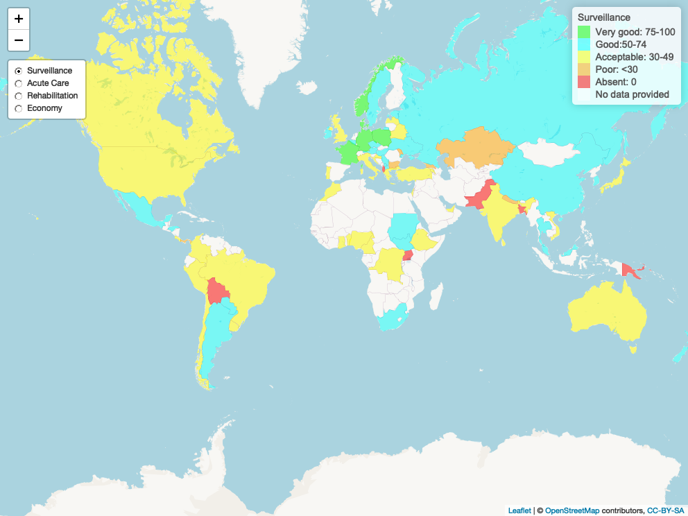

```{r setup, include=FALSE}
knitr::opts_chunk$set(echo = TRUE)
knitr::read_chunk("lancet_interactive_maps.R")
```
```{r LoadLibraries, warning=FALSE, message=FALSE, echo=FALSE, results='hide'}


```


```{r HelperFunctions, warning=FALSE, message=FALSE, echo=FALSE, results='hide'}


```

```{r LoadData, warning=FALSE, message=FALSE, echo=FALSE, results='hide'}


```


```{r LoadDataWorld, warning=FALSE, message=FALSE, echo=FALSE, results='hide'}

```


```{r Map1, warning=FALSE, message=FALSE, echo=FALSE, results='hide', cache=FALSE}


```

```{r Map2, warning=FALSE, message=FALSE, echo=FALSE, results='hide', cache=FALSE}


```

```{r, SaveMaps, warning=FALSE, message=FALSE, echo=FALSE, results='hide', cache=FALSE}


```


# Comission on Stroke


Interactive display of maps and data presented in the Lancet Neurology paper: Commission on Stroke: The Wind of Change. This is an interactive display (https://gntem2.github.io/CommissionOnStroke/) of the maps in the paper submitted to Lancet Neurology.


Click on the images for interactive versions of the maps.


# [Stroke surveillance, acute services, rehabilitation services and prevention](./worldstrokemap1.html)


[](./worldstrokemap1.html)


# [Stroke prevention](./worldstrokemap2.html)


