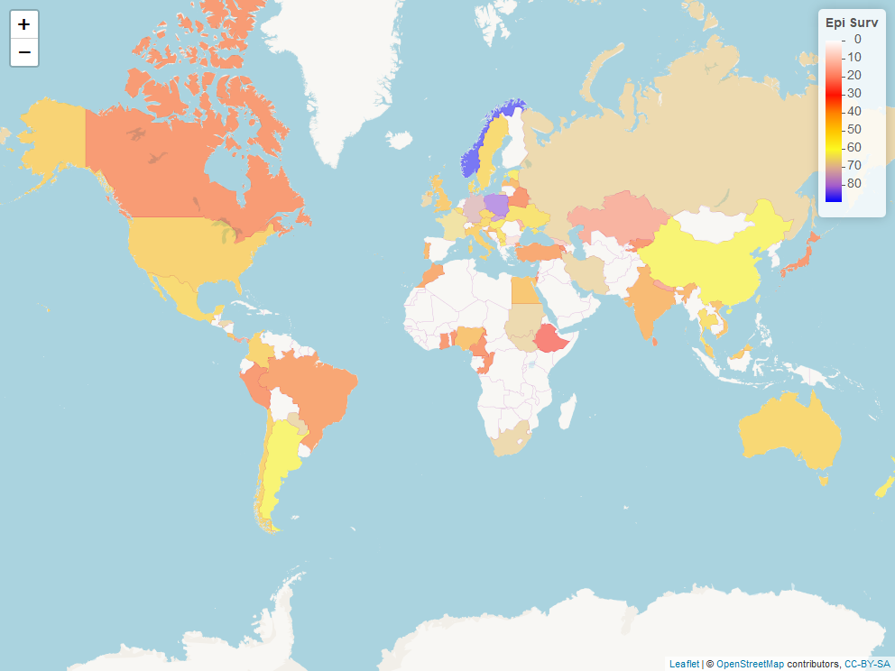
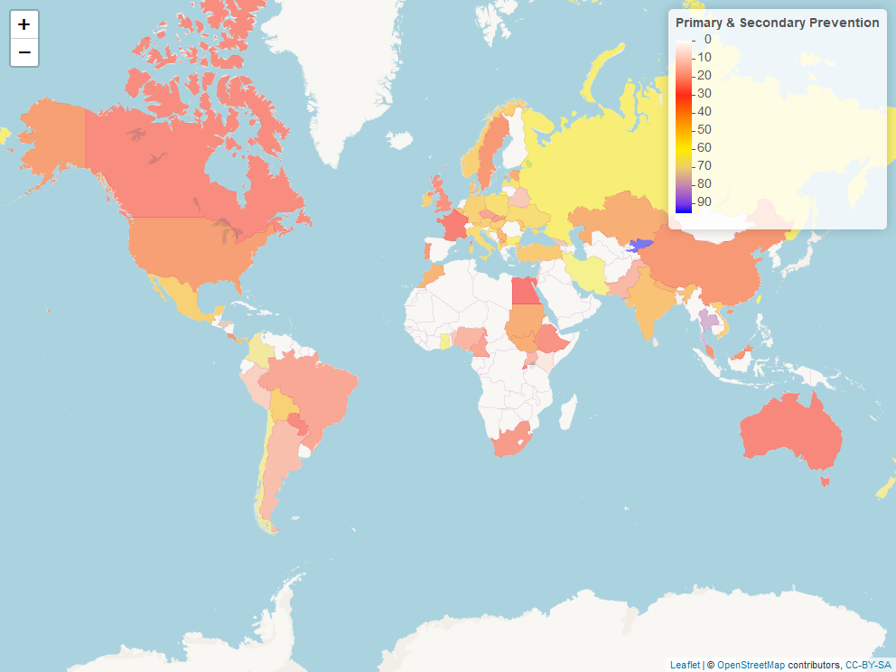
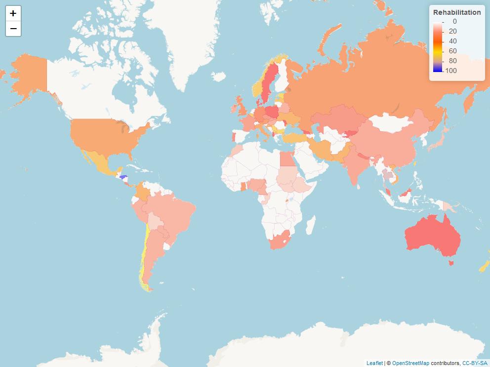
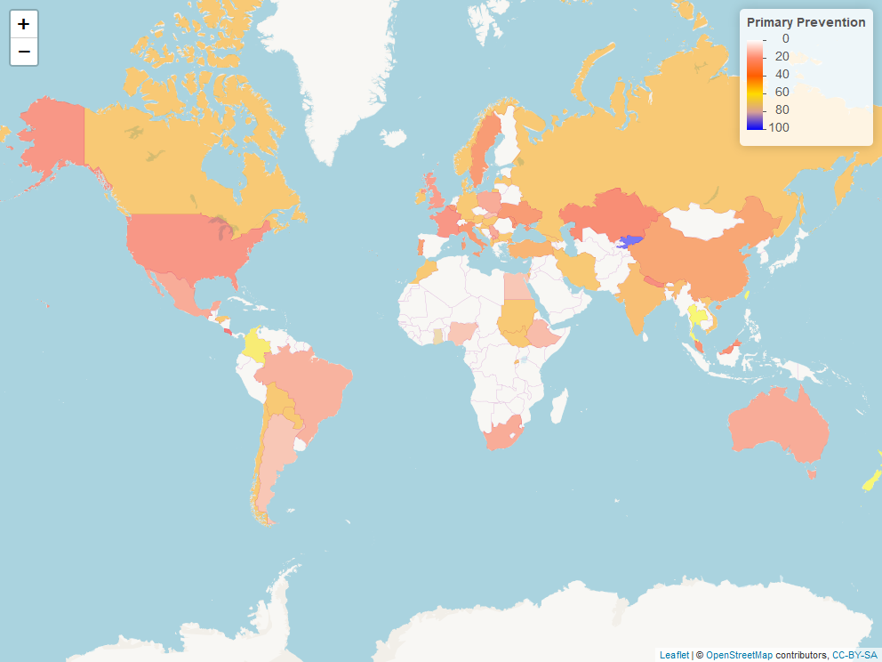
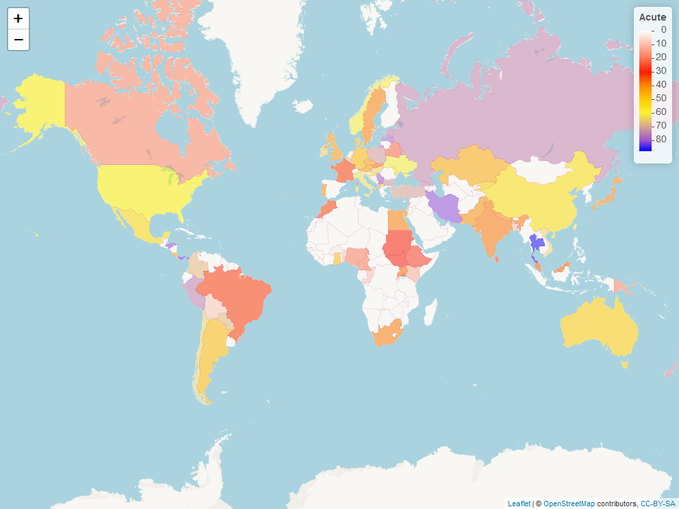

# CommissionOnStroke
Interactive display of maps in the Lancet Neurology paper: Commission on Stroke: The Wind of Change
This is an interactive display of the maps in the paper submitted to Lancet Neurology. 

Figure 2 is taken from data in Supplementary Table 1: column titled 'Surveillance'. Click on the map to access interactive version of Figure2.

Figure 4a is taken from data in Supplementary Table 1: column titled 'Prevention'.Click on the map to access interactive version of Figure4a.

Figure 4b is taken from data in Supplementary Table 8: column titled 'Overall Score for Primary Prevention'.Click on the map to access interactive version of Figure4b.

Figure 4c is taken from data in Supplementary Table 8: column titled 'Overall Score for Secondary Prevention'.Click on the map to access interactive version of Figure4c.

Figure 5 is taken from data in Supplementary Table 1: column titled 'Acute'.Click on the map to access interactive version of Figure5.

Figure 7 is taken from data in Supplementary Table 1: column titled 'Rehabilitation'.Click on the map to access interactive version of Figure7.

