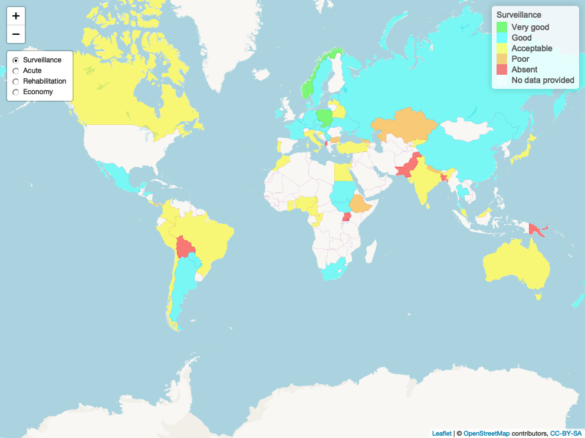
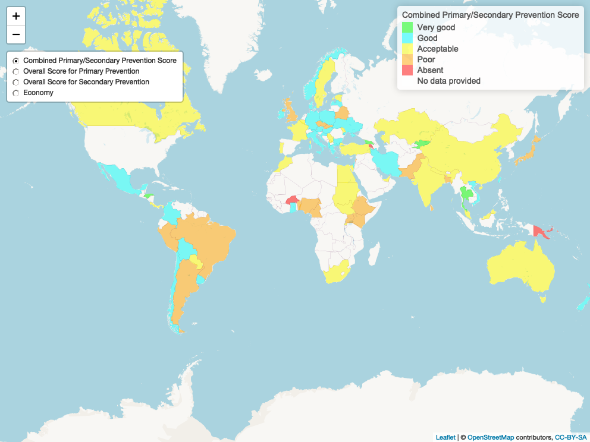

# Commission on Stroke

The World Stroke Organization (WSO)-World Health Organisation (WHO)-Lancet Neurology Commission on Stroke conducted a survey of the status of stroke services in low and middle income countries (LMICs) compared to  high income countries (HICs). This repository contains an interactive display of maps and data from that survey [Click on images for interactive version of maps](https://gntem2.github.io/CommissionOnStroke/) . The material has been published in International Journal of Stroke (The state of stroke services across the globe: Report of World Stroke Organization-World Health Organization surveys, DOI: 10.1177/17474930211019568) and Lancet Public Health (Primary stroke prevention worldwide: translating evidence into action, DOI:https://doi.org/10.1016/S2468-2667(21)00230-9).   

# [Stroke surveillance, acute services, rehabilitation services and prevention](./worldstrokemap1.html)

# [Stroke prevention](./worldstrokemap2.html)

