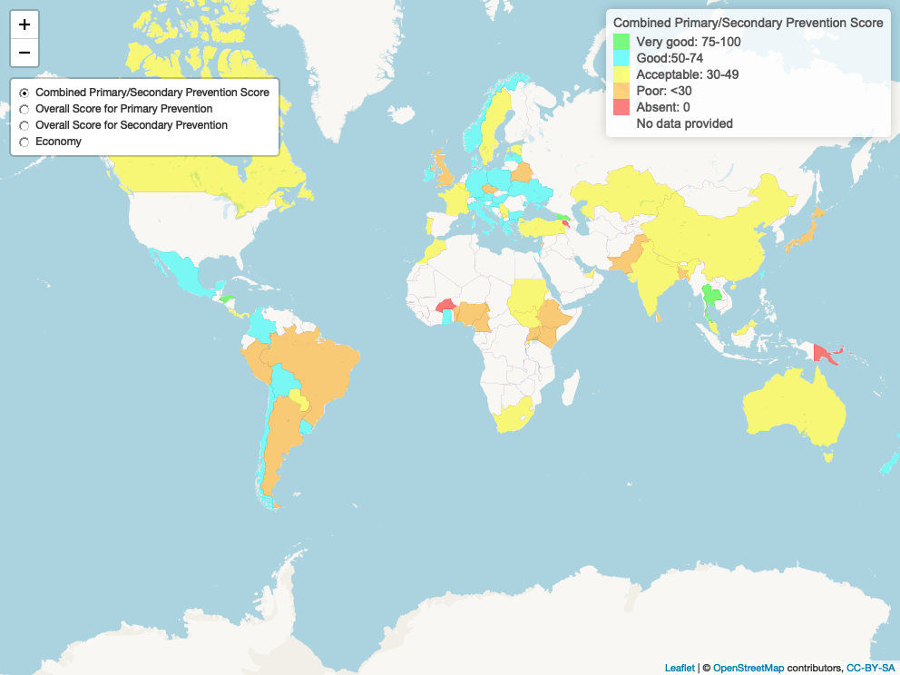

<!-- Global site tag (gtag.js) - Google Analytics -->
  
    
    
Interactive display of maps and data presented in the Lancet Neurology paper: Commission on Stroke: The Wind of Change. This is an interactive display (https://gntem2.github.io/CommissionOnStroke/) of the maps in the paper submitted to Lancet Neurology.

Click on the images for interactive versions of the maps.

# [Stroke surveillance, acute services, rehabilitation services and prevention](./worldstrokemap1.html)

# [Stroke prevention](./worldstrokemap2.html)

